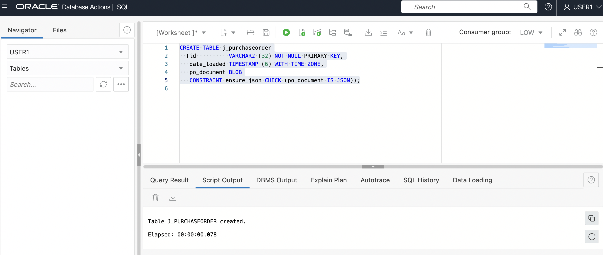
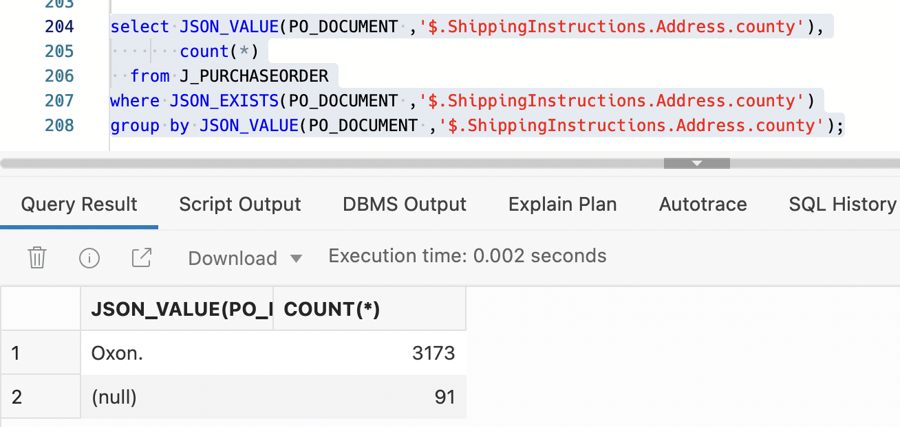

# 在Oracle数据库中使用SQL查询JSON数据

## 简介

Oracle 数据库原生支持 JSON 数据和关系数据库特性一样，包括事务、索引、声明式查询和视图。与关系数据不同，JSON 数据可以存储在数据库中、索引和查询，而无需定义数据的模式。

JSON 数据是无模式的（schemaless），即使使用数据库模式来定义存储它的表和列。该模式中没有任何内容指定 JSON 数据本身的结构。Oracle 数据库提供了与 JSON 一起使用的关系数据库功能的所有优点，包括事务、索引、声明性查询和视图。

使用SQL的数据库查询是声明性的。借助 Oracle 数据库，您可以使用 SQL 将 JSON 数据与关系数据连接起来。您可以关联 JSON 数据，使其可用于关系流程和工具。您还可以从数据库内部查询存储在 Oracle 数据库外部的外部表中的 JSON 数据。

本实验将会练习如何使用Oracle数据库的SQL语句及相应的函数包，访问JSON数据。

### 先决条件

- OCI相应的账号及权限
- 在OCI上创建ADB实例（本实验推荐使用ATP。ADW目前不支持MongoDB API，ATP包括全部AJD的功能，AJD没有BYOL模式）


## Task1: 创建实验用户

1. 在OCI控制台，自治数据库详细信息页面，点击**Database Action**, 以Admin用户登陆

   

2. 在Database Action页面选择SQL链接

   

3. 在SQL Worksheet中拷贝下列语句并执行，该脚本创建了一个user1的用户，并授予了相应的权限。

   ```
   -- USER SQL
   CREATE USER USER1 IDENTIFIED BY WelcomePTS_2022#;
   
   -- ADD ROLES
   GRANT DWROLE TO USER1;
   GRANT SODA_APP TO USER1;
   
   -- ENABLE REST
   BEGIN
       ORDS.ENABLE_SCHEMA(
           p_enabled => TRUE,
           p_schema => 'USER1',
           p_url_mapping_type => 'BASE_PATH',
           p_url_mapping_pattern => 'user1',
           p_auto_rest_auth=> TRUE
       );
       commit;
   END;
   /
   
   -- QUOTA
   ALTER USER USER1 QUOTA UNLIMITED ON DATA;
   ```

   

4. 运行成功后，退出Admin用户。

   

5. 重新以user1用户登录

   

6. 进入SQL Worksheet

   

   


## Task 2: 创建带JSON字段的表

您可以使用数据类型为 VARCHAR2、CLOB 或 BLOB 的列将 JSON 数据存储在 Oracle 数据库中。 无论您使用哪种类型，您都可以像操作这些类型的任何其他数据一样操作 JSON 数据。 使用标准数据类型存储 JSON 数据允许 Oracle 数据库的所有功能（例如高级复制）处理包含 JSON 文档的表。 选择使用哪个通常取决于您需要管理的 JSON 文档的大小：

- VARCHAR2(4000)：如果确定最大的 JSON 文档不超过 4000 个字节（或字符） 。
- VARCHAR2(32767)：如果知道某些 JSON 文档大于 4000 字节（或字符）并且确定没有任何文档超过 32767 字节 。使用 VARCHAR2(32767)，文档的前大约 3.5K 字节（或字符）存储在行中，作为表行的一部分。 这意味着使用 VARCHAR2(32767) 相比 VARCHAR2(4000) 的额外成本仅对于于那些大于大约 3.5K 的文档。 如果您的大多数文档都小于此值，那么跟使用 VARCHAR2(4000) 的性能差异很小。
- CLOB：对于大于32767的JSON文档。Oracle建议使用BLOB，因为JSON文档缺省字符集为AL32UTF8，采用CLOB存储JSON数据会有隐含的字符集转换。
- BLOB：对于大于32767的JSON文档。如果您想要更快的查询和更新性能，请使用Oracle优化二进制格式OSON的BLOB存储。在定义时增加限制条件：`is json FORMAT OSON`。该特性在19c版本中仅支持自治数据库。

1. 在SQL Worksheet里运行下列命令来创建一个表JSON字段的表，这里我们用BLOB来存放JSON数据

   ```
   CREATE TABLE j_purchaseorder
     (id          VARCHAR2 (32) NOT NULL PRIMARY KEY,
      date_loaded TIMESTAMP (6) WITH TIME ZONE,
      po_document BLOB
      CONSTRAINT ensure_json CHECK (po_document IS JSON));
   ```

   

2. 在该表中插入JSON数据，你可以查看该数据是一个电商订单数据，包括订单号、客户地址、订单商品等信息。

   ```
   INSERT INTO j_purchaseorder
     VALUES (
       SYS_GUID(),
       to_date('30-DEC-2014'),
       '{"PONumber"             : 1600,
         "Reference"            : "ABULL-20140421",
         "Requestor"            : "Alexis Bull",
         "User"                 : "ABULL",
         "CostCenter"           : "A50",
         "ShippingInstructions" :
           {"name"    : "Alexis Bull",
            "Address" : {"street"  : "200 Sporting Green",
                         "city"    : "South San Francisco",
                         "state"   : "CA",
                         "zipCode" : 99236,
                         "country" : "United States of America"},
            "Phone"   : [{"type" : "Office", "number" : "909-555-7307"},
                         {"type" : "Mobile", "number" : "415-555-1234"}]},
         "Special Instructions" : null,
         "AllowPartialShipment" : true,
         "LineItems"            :
           [{"ItemNumber" : 1,
             "Part"       : {"Description" : "One Magic Christmas",
                             "UnitPrice"   : 19.95,
                             "UPCCode"     : 13131092899},
             "Quantity"   : 9.0},
            {"ItemNumber" : 2,
             "Part"       : {"Description" : "Lethal Weapon",
                             "UnitPrice"   : 19.95,
                             "UPCCode"     : 85391628927},
             "Quantity"   : 5.0}]}');
   
   INSERT INTO j_purchaseorder
     VALUES (
       SYS_GUID(),
       to_date('30-DEC-2014'),
       '{"PONumber"             : 672,
         "Reference"            : "SBELL-20141017",
         "Requestor"            : "Sarah Bell",
         "User"                 : "SBELL",
         "CostCenter"           : "A50",
         "ShippingInstructions" : {"name"    : "Sarah Bell",
                                   "Address" : {"street"  : "200 Sporting Green",
                                                "city"    : "South San Francisco",
                                                "state"   : "CA",
                                                "zipCode" : 99236,
                                                "country" : "United States of America"},
                                   "Phone"   : "983-555-6509"},
         "Special Instructions" : "Courier",
         "LineItems"            :
           [{"ItemNumber" : 1,
             "Part"       : {"Description" : "Making the Grade",
                             "UnitPrice"   : 20,
                             "UPCCode"     : 27616867759},
             "Quantity"   : 8.0},
            {"ItemNumber" : 2,
             "Part"       : {"Description" : "Nixon",
                             "UnitPrice"   : 19.95,
                             "UPCCode"     : 717951002396},
             "Quantity"   : 5},
            {"ItemNumber" : 3,
             "Part"       : {"Description" : "Eric Clapton: Best Of 1981-1999",
                             "UnitPrice"   : 19.95,
                             "UPCCode"     : 75993851120},
             "Quantity"   : 5.0}]}');
   
   COMMIT;
   ```

   


## Task 3: 简单查询JSON数据

点符号是最简单，通用并且常用的查询JSON数据的方法。点表示法查询的返回值始终是表示 JSON 数据的字符串。 字符串的内容取决于目标 JSON 数据：

- 如果目标是单个 JSON 值，则该值是字符串内容，无论它是 JSON 标量、对象还是数组。
- 如果以多个 JSON 值为目标，则字符串内容是一个 JSON 数组。

1. 运行下列语句查看返回的订单号。

   ```
   SELECT po.po_document.PONumber FROM j_purchaseorder po;
   ```

   

2. 查看每个订单的具体商品，返回的是一个JSON数组

   ```
   SELECT po.po_document.LineItems FROM j_purchaseorder po;
   ```

   

3. 要查看返回的数据的详细信息，可以点击该行记录的眼镜图标

   

4. 可以看到该订单包含两个商品，及相应的商品信息。

   

   

## Task 4: 修改JSON数据

您可以使用Oracle SQL函数`json_transform`或`json_mergepatch`修改json文档的特定部分。这些函数不仅用于更新存储的JSON数据。还可以使用它们在查询中动态修改JSON数据，数据库无需更新。

使用`json_transform`进行更新是分段的：只指定要更改的文档片段以及如何更改。客户端只需要发送更改的位置（使用SQL/JSON路径表达式）和要执行的更新操作。

`json_mergepatch`在某些上下文中更易于使用，其中补丁文档是通过比较文档的两个版本生成的。您无需指定或考虑特定的修改位置和操作-生成的修补程序负责更改位置，并且要进行的更改是隐式的。

1. 使用`json_transform`更新`j_purchaseorder.po_document`中的所有文档。将字段lastUpdated的值设置为当前时间戳。qu缺省操作是：如果字段已经存在，则替换其值；否则，将添加字段及其值。所以在本例中会增加一个lastUpdate字段。

    ```
    UPDATE j_purchaseorder SET po_document =
      json_transform(po_document, SET '$.lastUpdated' = SYSTIMESTAMP);
    ```

    

2. 使用`json_transform`删除某个字段，如：`Special Instructions`

    ```
    SELECT json_transform(po_document, REMOVE '$."Special Instructions"'
                          RETURNING CLOB PRETTY) as jsontrans
      FROM j_purchaseorder;
    ```

    

3. 使用`json_transform`创建或替换键值

    ```
    SELECT json_transform(po_document,
                   SET '$.ShippingInstructions.Address' =
                       '{"street":"8 Timbly Rd.",
                         "city":"Penobsky",
                         "state":"UT"}'
                       FORMAT JSON RETURNING CLOB PRETTY) as jsontrans
         FROM j_purchaseorder;
    ```

    

4. 使用`json_mergepatch`去除`Special Instructions`键值

    ```
    select json_mergepatch(po_document, '{"Special Instructions":null}'
         PRETTY)
         FROM j_purchaseorder;
    ```

    

5. 下列语句使用`json_mergepatch`，修改了JSON文档：

    - 增加了一组"Category":"Platinum"键值
    - 去除"ShippingInstructions"键值
    - 修改"Special Instructions"的值为Contact User SBELL
    - 修改"LineItems"的值为空数组
    - 删除了"AllowPartialShipment"键值
    - 增加了"Allow Partial Shipment":false键值对

    ```
    select json_mergepatch(po_document, '{ 
      "Category" : "Platinum",
      "ShippingInstructions" : null,
      "Special Instructions" : "Contact User SBELL",
      "LineItems" : [],
      "AllowPartialShipment" : null,
      "Allow Partial Shipment" : false }'
         PRETTY)
         FROM j_purchaseorder;
    ```

6. 清空该JSON表。

    ```
    truncate table j_purchaseorder;
    ```

    

## Task 5: 加载外部文件到JSON表

下面我们将加载更多数据到JSON表中，我们将文本文件上传到OCI的对象存储中，该文件可以从该链接下载：[PurchaseOrder.txt](https://objectstorage.ap-seoul-1.oraclecloud.com/p/lr39i2w3Y-GUQc7COm8voM9cWloD_x6J09bUc3ADOkdmMjw834ca7Wk-oabXmGtu/n/oraclepartnersas/b/external-table/o/PurchaseOrders.txt)。

1. 创建对象存储认证信息，你可以用自己的用户名，Auth Token作为password。

   ```
   BEGIN
     dbms_cloud.create_credential(
       credential_name => 'OBJ_STORE_CRED',
       username => 'firstname.lastname@email.com',
       password => '+.WpZJFF24-Fd3K_k1l.'
     );
   END;
   ```

   

2. 创建外部表，你可以使用自己的文件路径。

   ```
   BEGIN
     DBMS_CLOUD.CREATE_EXTERNAL_TABLE (
      table_name =>'JSON_FILE_PO',
      credential_name =>'OBJ_STORE_CRED',
      file_uri_list =>'https://objectstorage.ap-seoul-1.oraclecloud.com/n/oraclepartnersas/b/external-table/o/PurchaseOrders.txt',
      column_list => 'json_document blob',
      field_list => 'json_document CHAR(20000)'
   );
   END;
   ```

   

3. 将外部表数据插入到JSON表中。

   ```
   insert into J_PURCHASEORDER
     select SYS_GUID(), SYSTIMESTAMP, JSON_DOCUMENT from JSON_FILE_PO;
     
   commit;
   ```

   

4. 查询不同Cost Center的订单总数

   ```
   select j.PO_DOCUMENT.CostCenter, count(*)
     from J_PURCHASEORDER j
    group by j.PO_DOCUMENT.CostCenter;
   ```

   

   


## Task 6: 使用`JSON_VALUE` 和 `JSON_QUERY`查询JSON数据

JSON 函数 `json_value` 和 `json_query` 可以用于更复杂的查询。 如果您提供的路径表达式与查询的 JSON 数据不匹配，它们可能会返回 NULL 或引发错误。 它们接受可选子句来指定返回值的数据类型（RETURNING 子句），是否将多个值包装为数组（wrapper子句），一般如何处理错误（ON ERROR 子句），以及如何处理丢失的 JSON 字段（ON EMPTY 子句）。

`JSON_VALUE`运算符使用JSON路径表达式访问单个标量值。它通常在选择列表中用于返回与JSON路径表达式关联的值，或在WHERE子句中用于根据JSON文档的内容筛选结果集。

`JSON_VALUE`接受两个参数，一个JSON列和一个JSON path表达式。它提供了一组修饰符，允许控制返回数据的格式，以及如何处理在计算JSON路径表达式时遇到的任何错误。

1. 下面用`JSON_VALUE`返回不同Cost Center的订单总数

   ```
   select JSON_VALUE(PO_DOCUMENT ,'$.CostCenter'), count(*)
     from J_PURCHASEORDER
    group by JSON_VALUE(PO_DOCUMENT ,'$.CostCenter');
   ```

   

2. 我们也可以从数组中访问值。使用index 0从LineItems数组第一个成员内的Part对象访问UPCCode的值。此查询还显示了如何在SQL语句的WHERE子句中使用`JSON_VALUE`作为过滤器。

   ```
   select JSON_VALUE(PO_DOCUMENT ,'$.LineItems[0].Part.UPCCode')
     from J_PURCHASEORDER p
    where JSON_VALUE(PO_DOCUMENT ,'$.PONumber' returning NUMBER(10)) = 450;
   ```

   

   `JSON_VALUE`函数还提供了处理将JSON PATH表达式应用于JSON文档时可能遇到的错误的选项。可用选项包括：

   - NULL ON ERROR：默认值。如果在将JSON路径表达式应用于JSON文档时遇到错误，则假定结果为SQL NULL，并且不会引发错误。

   - ERROR ON ERROR：将JSON路径表达式应用于JSON文档时遇到错误时，会引发错误。

   - DEFAULT on ERROR：开发人员指定遇到错误时返回的文本值。

3. 假设我们输入错误的路径，`ShippingInstruction`而不是`ShippingInstructions`，缺省返回NULL。

   ```
   select JSON_VALUE(PO_DOCUMENT ,'$.ShippingInstruction.Address')
     from J_PURCHASEORDER
    where JSON_VALUE(PO_DOCUMENT ,'$.PONumber' returning NUMBER(10)) = 450;
   ```

   

4. 自定义遇到错误时返回`N/A`。

   ```
   select JSON_VALUE(PO_DOCUMENT, '$.ShippingInstruction.Address' DEFAULT 'N/A' ON ERROR)
     from J_PURCHASEORDER
    where JSON_VALUE(PO_DOCUMENT ,'$.PONumber' returning NUMBER(10)) = 450;
   ```

   

5. `JSON_QUERY`是`JSON_VALUE`的补充。`JSON_VALUE`只能返回标量值，而`JSON_QUERY`只能返回对象或数组。与`JSON_VALUE`一样，`JSON_QUERY`接受两个参数，一个JSON列和一个JSON路径表达式。它提供了一组修饰符，允许控制返回数据的格式，以及如何处理在计算JSON路径表达式时遇到的任何错误。以下查询返回订单里的所有商品，返回的是JSON数组。

   ```
   select JSON_QUERY(PO_DOCUMENT ,'$.LineItems')
     from J_PURCHASEORDER p
    where JSON_VALUE(PO_DOCUMENT ,'$.PONumber' returning NUMBER(10)) = 450;
   ```

   

6. 我们可以使用PRETTY关键字格式化`JSON_query`的输出。我们可以点击眼镜图标查看详细返回信息

   ```
   select JSON_QUERY(PO_DOCUMENT ,'$.LineItems' PRETTY)
     from J_PURCHASEORDER p 
    where JSON_VALUE(PO_DOCUMENT ,'$.PONumber' returning NUMBER(10)) = 450;
   ```

   

7. 通过index只取其中一条商品信息，index为0表示数组的第一个成员。

   ```
   select JSON_QUERY(PO_DOCUMENT ,'$.LineItems[0]' PRETTY)
     from J_PURCHASEORDER p
    where JSON_VALUE(PO_DOCUMENT ,'$.PONumber' returning NUMBER(10)) = 450;
   ```

   

8. 使用WITH ARRAY WRAPPER强制`JSON_query`始终以数组形式返回结果。在本例中，索引为星号，表示应处理LineItems数组的所有成员，JSON路径表达式中的最后一个键也是星号，表明应处理Part键的所有子项。执行此查询的结果是一个包含6个项的数组。前3项来自与LineItems数组第一个成员的Part键关联的Description、UnitPrice和UPCCode。第二个3来自与LineItems数组第二个成员的Part键关联的Description、UnitPrice和UPCCode。还要注意，由于Description和UPCCode是字符串，UnitPrice是数字，因此生成的数组本质上是异构的，包含字符串和数值的混合。

   ```
   select JSON_QUERY(PO_DOCUMENT, '$.LineItems[*].Part.*' WITH ARRAY WRAPPER)
     from J_PURCHASEORDER p
    where JSON_VALUE(PO_DOCUMENT ,'$.PONumber' returning NUMBER(10)) = 450;
   ```

   

   

## Task 7: 使用`JSON_TABLE`以关系型方式访问JSON数据

`JSON_TABLE`运算符用于SQL语句的FROM子句中。它支持创建JSON内容的内联关系视图。`JSON_TABLE`运算符使用一组JSON路径表达式将JSON文档中的内容映射到视图中的列中。一旦JSON文档的内容被展开为列，SQL的所有功能就可以在JSON文档内容上发挥作用。

1. 下面显示了如何从文档中最多出现一次的值投影一组列。这些值可以来自任何级别的嵌套，只要它们不是来自作为数组一部分的键或从数组派生的键，除非使用索引来标识数组中的一个项。

   ```
   select M.*
     from J_PURCHASEORDER p,
          JSON_TABLE(
          p.PO_DOCUMENT ,
          '$' 
          columns 
            PO_NUMBER  NUMBER(10)        path '$.PONumber',
            REFERENCE  VARCHAR2(30 CHAR) path '$.Reference',
            REQUESTOR  VARCHAR2(32 CHAR) path '$.Requestor',
            USERID     VARCHAR2(10 CHAR) path '$.User',
            COSTCENTER VARCHAR2(16 CHAR) path '$.CostCenter',
            TELEPHONE  VARCHAR2(16 CHAR) path '$.ShippingInstructions.Phone[0].number'
          ) M
    where PO_NUMBER between 450 and 455;
   ```

   

2. 下列查询显示了如何使用数组。为了将数组的内容展开为一组行，必须使用NESTED PATH语法处理数组。当`JSON_TABLE`运算符包含NESTED PATH子句时，它将为最深的NESTED PETH子句引用的数组的每个成员输出一行。该行将包含由`JSON_TABLE`表达式的每个级别定义的所有列。

   ```
   select D.*
     from J_PURCHASEORDER p,
          JSON_TABLE(
            p.PO_DOCUMENT ,
            '$' 
            columns(
              PO_NUMBER    NUMBER(10)            path  '$.PONumber',
              REFERENCE    VARCHAR2(30 CHAR)     path  '$.Reference',
              REQUESTOR    VARCHAR2(32 CHAR)     path  '$.Requestor',
              USERID       VARCHAR2(10 CHAR)     path  '$.User',
              COSTCENTER   VARCHAR2(16)          path  '$.CostCenter',
              NESTED PATH '$.LineItems[*]'
              columns(
                ITEMNO       NUMBER(16)           path '$.ItemNumber', 
                DESCRIPTION  VARCHAR2(32 CHAR)    path '$.Part.Description', 
                UPCCODE      VARCHAR2(14 CHAR)    path '$.Part.UPCCode', 
                QUANTITY     NUMBER(5,4)          path '$.Quantity', 
                UNITPRICE    NUMBER(5,2)          path '$.Part.UnitPrice'
              )
            )
          ) D
    where PO_NUMBER between 450 and 455;
   ```

   

   

## Task 8: 使用`JSON_EXISTS`过滤结果集

`JSON_EXISTS`运算符用于SQL语句的WHERE子句中。它用于测试JSON文档是否包含与提供的JSON路径表达式匹配的内容。

`JSON_EXISTS`运算符接受两个参数，一个JSON列和一个JSON path表达式。如果文档包含匹配JSON路径表达式的键，则返回TRUE，否则返回FALSE。`JSON_EXISTS`提供了一组修饰符，用于控制如何处理在计算JSON路径表达式时遇到的任何错误。

1. 下列查询统计ShippingInstructions键下的Address键包含state键的JSON文档数：

   ```
   select count(*)
     from J_PURCHASEORDER
    where JSON_EXISTS(PO_DOCUMENT ,'$.ShippingInstructions.Address.state');
   ```

   

2. `JSON_VALUE`无法区分没有键的文档和有键但值为空的文档。下列语句`JSON_VALUE`返回NULL，因为该键在文档中不存在，或者是因为该键存在，但该值包含NULL或空值。

   ```
   select JSON_VALUE(PO_DOCUMENT ,'$.ShippingInstructions.Address.county'), 
          count(*)
     from J_PURCHASEORDER
    group by JSON_VALUE(PO_DOCUMENT ,'$.ShippingInstructions.Address.county');
   ```

   

3. `JSON_EXISTS`可以区分没有键的文档和有键但值为空的文档。下列语句返回的NULL，只包括该键存在，但该值包含NULL或空值的记录。

   ```
   select JSON_VALUE(PO_DOCUMENT ,'$.ShippingInstructions.Address.county'),
          count(*)
     from J_PURCHASEORDER
   where JSON_EXISTS(PO_DOCUMENT ,'$.ShippingInstructions.Address.county')
   group by JSON_VALUE(PO_DOCUMENT ,'$.ShippingInstructions.Address.county');
   ```

   

4. `JSON_EXISTS`还支持谓词使用的JSON路径表达式。谓词通过添加`?`来指定然后在括号中指定条件。在谓词中，`@`符号用于引用父键。变量由前缀为`$`符号的名称表示。变量的值是使用`JSON_EXISTS`运算符的PASSING子句设置的。这允许在开发应用程序时使用绑定变量提供值。下面的语句显示了在JSON路径表达式中使用谓词的一个非常简单的示例。PONumber是顶级JSON对象的成员。

   ```
   select j.PO_DOCUMENT
     from J_PURCHASEORDER j
    where JSON_EXISTS(
            PO_DOCUMENT,
            '$?(@.PONumber == $PO_NUMBER)' 
            passing 450 as "PO_NUMBER"
          );
   ```

   

5. 下一个语句展示了如何提供多个谓词以及如何执行数值范围查询。第一个条件是User键的值。User是顶级对象的成员。第二个条件是Quantity键的值。Quantity出现在数组LineItems的每个对象中。这两个条件使用“&&”运算符链接。第二个条件中的“>”条件表示需要范围搜索。

   ```
   select count(*)
     from J_PURCHASEORDER j
    where JSON_EXISTS(
            PO_DOCUMENT,
            '$?(@.User == $USER && @.LineItems.Quantity > $QUANTITY)' 
            passing 'AKHOO' as "USER", 8 as "QUANTITY");
   ```

   

## Task 9: JSON Dataguide

JSON Dataguide允许您发现有关存储在Oracle数据库中的JSON文档的结构和内容的信息。此信息可以多种方式使用，包括：

- 生成描述JSON文档集的JSON模式文档

- 创建对JSON文档启用关系SQL操作的视图

- 基于简单的键:值对自动添加虚拟列

为了生成JSON Dataguide，我们需要对数据库中的JSON内容进行分析。以下语句显示了如何在存储在Oracle数据库中的一组JSON文档上创建Dataguide，以及如何使用Dataguide来发现存储在数据库中的文档的元数据。它还展示了如何使用Dataguide创建关系视图，以支持基于SQL的报告和分析的方式展示JSON文档的内容。

1. 我们可以使用`json_dataguide`聚合操作符。就像其他聚合操作符一样，`json_dataguide`扫描json文档列，并动态构建dataguide。用户可以向语句中添加where子句或sampling子句。

   ```
   select json_dataguide(po_document) from j_purchaseorder;
   
   select json_dataguide(po_document) from j_purchaseorder where JSON_VALUE(PO_DOCUMENT ,'$.PONumber' returning NUMBER(10)) <= 450;
   
   select json_dataguide(po_document) from j_purchaseorder sample (20);
   ```

   

2. 我们也可以格式化输出

   ```
   select json_dataguide(po_document, dbms_json.format_hierarchical, dbms_json.pretty) from j_purchaseorder;
   ```

   

3. 使用create_view过程根据Dataguide中的信息创建关系视图

   ```
   declare
     dg clob;
   begin
     select json_dataguide(po_document, dbms_json.format_hierarchical) into dg from j_purchaseorder;
     dbms_json.create_view('J_PURCHASEORDER_VIEW1', 'J_PURCHASEORDER', 'PO_DOCUMENT', dg, resolveNameConflicts=>TRUE);
   end;
   
   select * from J_PURCHASEORDER_VIEW1;
   ```

   

4. 创建Dataguide的另一种方法是使用JSON搜索索引。由于Dataguide基于JSON搜索索引基础架构，我们可以选择使用单个索引来驱动Dataguide和搜索操作。但是，如果我们只需要Dataguide功能，我们可以通过使用`create-search-index`语句的parameters子句指定选项`“search_on none”`和`“dataguide-on”`来避免与维护搜索索引相关的开销。

   ```
   create search index JSON_SEARCH_INDEX on J_PURCHASEORDER (PO_DOCUMENT) for json parameters('search_on none dataguide on');
   ```

   

5. 方法`get_index_dataguide()`可以以两种格式返回存储在JSON搜索索引中的Dataguide。我们可以比较一下两种格式的区别。

   ```
   select DBMS_JSON.GET_INDEX_DATAGUIDE('J_PURCHASEORDER', 'PO_DOCUMENT', DBMS_JSON.FORMAT_HIERARCHICAL, DBMS_JSON.PRETTY ) "HIERARCHICAL DATA GUIDE" from dual;
   
   select DBMS_JSON.GET_INDEX_DATAGUIDE('J_PURCHASEORDER', 'PO_DOCUMENT', DBMS_JSON.FORMAT_FLAT, DBMS_JSON.PRETTY ) "FLAT DATA GUIDE" from dual;
   ```

   

6. 下面使用`create_view_on_path`过程根据Dataguide中的信息创建关系视图。

   ```
   begin 
     DBMS_JSON.CREATE_VIEW_ON_PATH( 'J_PURCHASEORDER_VIEW', 'J_PURCHASEORDER', 'PO_DOCUMENT', '$' ); 
   end;
   
   select * from J_PURCHASEORDER_VIEW;
   ```

   

7. 我们可以看到创建视图的列名是根据JSON文档路径自动生成的，为了使用用户友好的列名，我们可以先自定义列名

   ```
   begin 
     DBMS_JSON.RENAME_COLUMN( 'J_PURCHASEORDER','PO_DOCUMENT', '$.PONumber',DBMS_JSON.TYPE_NUMBER,'PO_NUMBER'); 
     DBMS_JSON.RENAME_COLUMN( 'J_PURCHASEORDER','PO_DOCUMENT', '$.Reference',DBMS_JSON.TYPE_STRING,'REFERENCE'); 
     DBMS_JSON.RENAME_COLUMN( 'J_PURCHASEORDER','PO_DOCUMENT', '$.LineItems.Part.UPCCode',DBMS_JSON.TYPE_NUMBER, 'UPC_CODE'); 
   end;
   
   begin 
     DBMS_JSON.CREATE_VIEW_ON_PATH( 'J_PURCHASEORDER_VIEW', 'J_PURCHASEORDER', 'PO_DOCUMENT', '$' ); 
   end;
   
   select * from J_PURCHASEORDER_VIEW;
   ```

   

   

   

