# SODA and Oracle DB API for MongoDB

## 简介

SODA（Simple Oracle Document Access）是一组NoSQL风格的API，允许您在Oracle数据库中创建和存储文档集合（特指JSON），检索并查询它们，而无需了解结构化查询语言（SQL）或文档在数据库中的存储方式。单独的SODA实现可用于不同的语言和REST架构风格。REST的SODA本身可以从几乎任何编程语言访问。它将SODA操作映射到统一资源定位器（URL）模式。

Oracle Database API for MongoDB允许使用MongoDB语言驱动程序和工具连接到Oracle Autonomous Database。目前只支持AJD和ATP。

### 先决条件

- OCI账号及相应权限

- 创建AJD或ATP实例（注：AJD没有BYOL模式，ATP包含AJD的所有功能）

  

## Task 1: 环境配置

1. 修改访问控制列表，要使用Oracle Database API for MongoDB必须配置访问控制列表。在ATP或AJD的详细信息页面，选择编辑访问控制列表。

    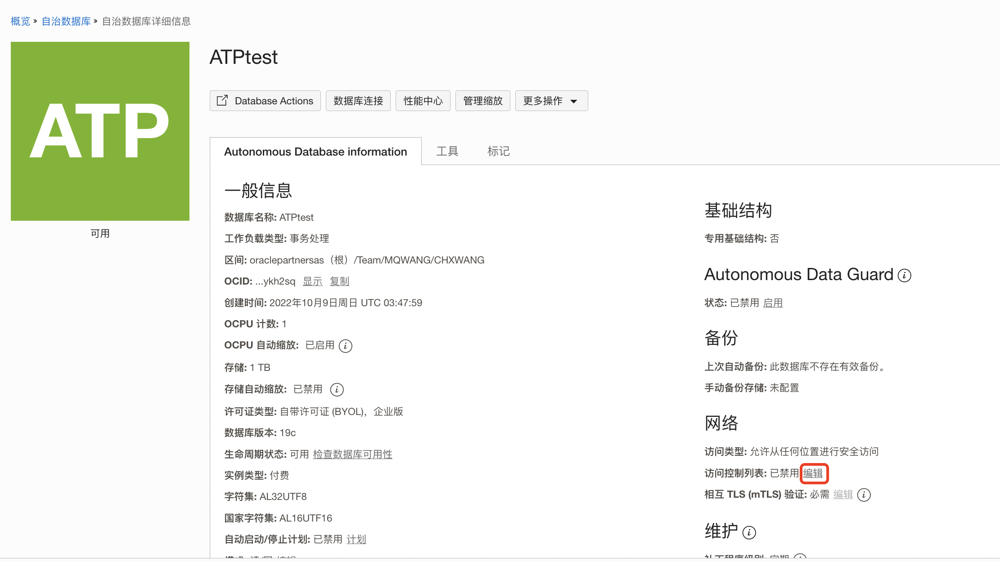

2. 在本练习中，我们选择CIDR块，输入`0.0.0.0/0`，配置任何客户端都能访问自治数据库，保存更改。

    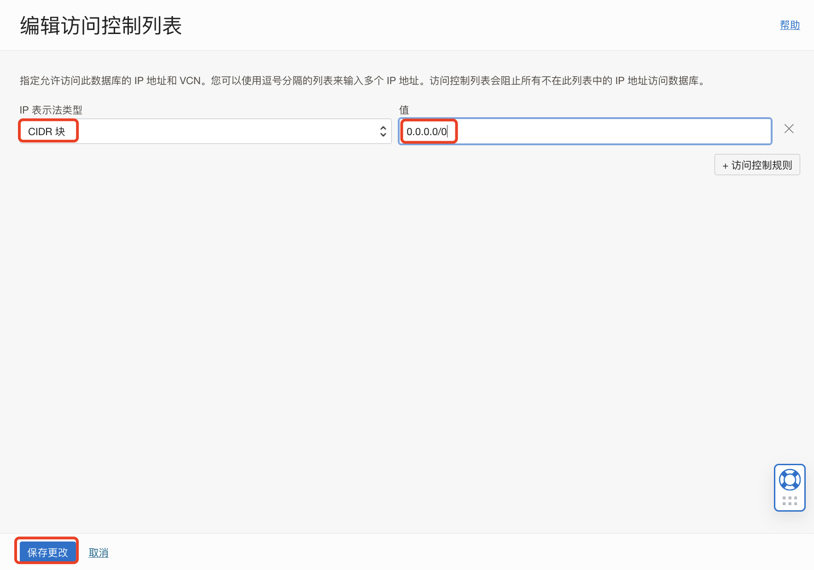

3. 在Database Actions页面中，以ADMIN用户登录，选择Oracle Database API for MongoDB。

    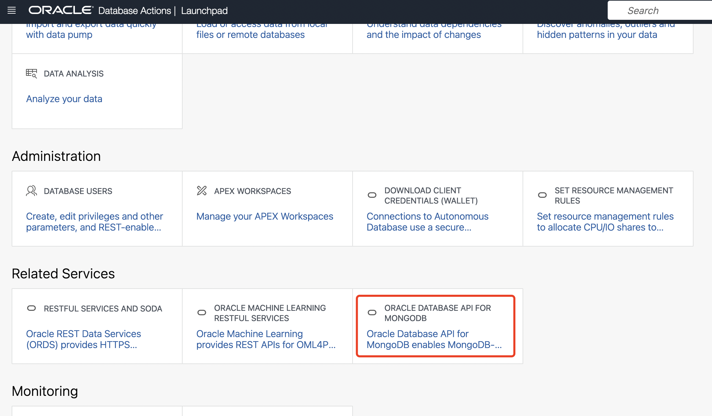

4. 拷贝Oracle Database API for MongoDB的URL。

    - 如果驱动程序支持loadBalanced属性，请复制端口为27017的字符串。
    - 如果驱动程序不支持loadBalanced属性，请复制端口为27016的字符串。

    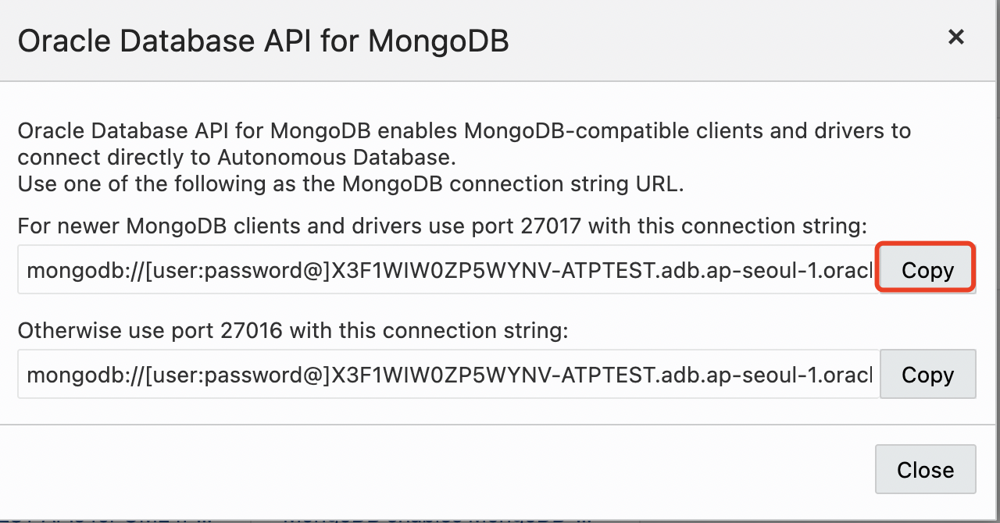

5. 选择Restful Services and SODA

    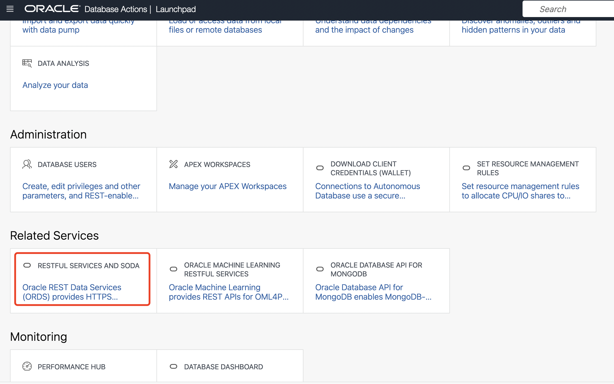

6. 拷贝ORDS URL

    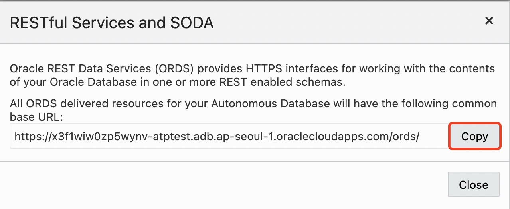

7. （如果已创建了实验用户，可以忽略此步骤）选择SQL Worksheet。

    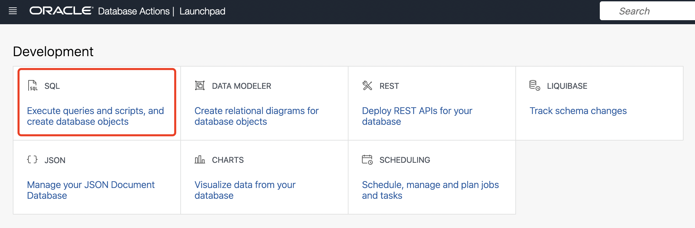

8. （如果已创建了实验用户，可以忽略此步骤）拷贝以下命令创建新用户并授权。要使用REST SODA需要授权SODA_APP角色。

    ```
    -- USER SQL
    CREATE USER USER1 IDENTIFIED BY WelcomePTS_2022#;
    
    -- ADD ROLES
    GRANT DWROLE TO USER1;
    GRANT SODA_APP TO USER1;
    
    -- ENABLE REST
    BEGIN
        ORDS.ENABLE_SCHEMA(
            p_enabled => TRUE,
            p_schema => 'USER1',
            p_url_mapping_type => 'BASE_PATH',
            p_url_mapping_pattern => 'user1',
            p_auto_rest_auth=> TRUE
        );
        commit;
    END;
    /
    
    -- QUOTA
    ALTER USER USER1 QUOTA UNLIMITED ON DATA;
    ```

    

## Task 2: JSON Collections

1. 以新用户user1登录，在Data Actions中选择JSON链接

    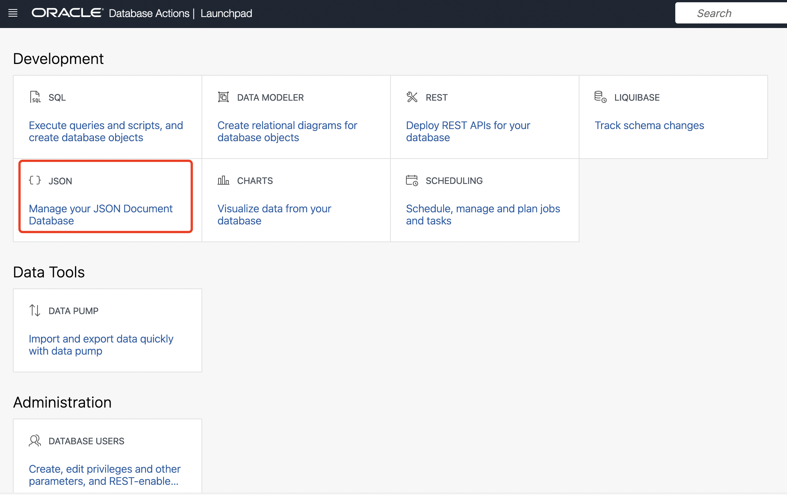

2. 点击创建Collection

    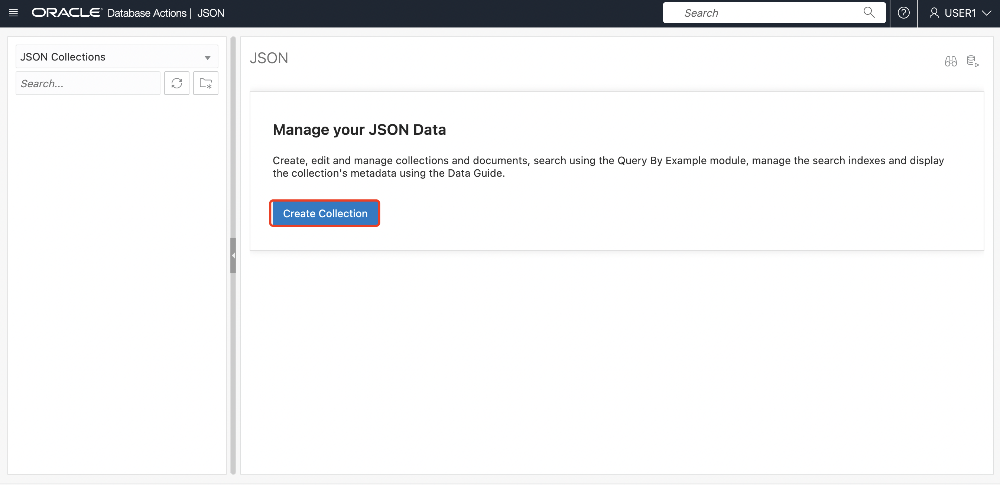

3. 输入**Collection**名：products，选择**MongoDB兼容模式**，点击**Create**

    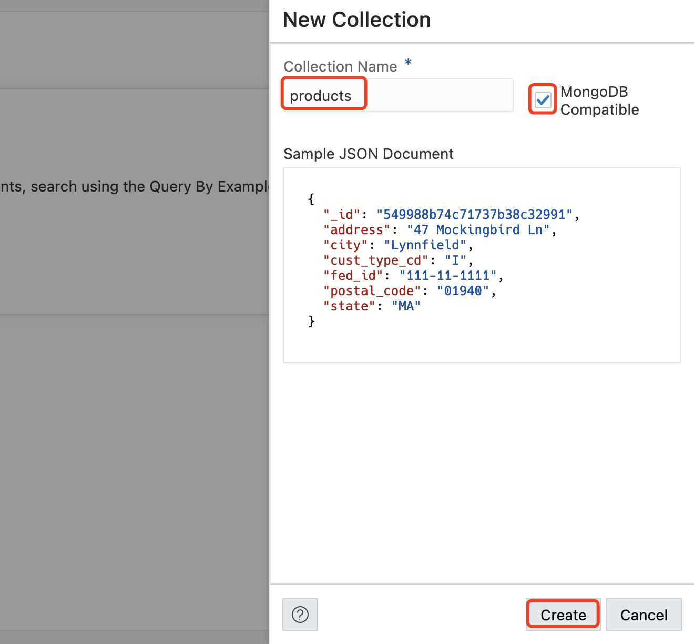

4. 双击**products**对象，确保当前在**JSON - products**的worksheet中

    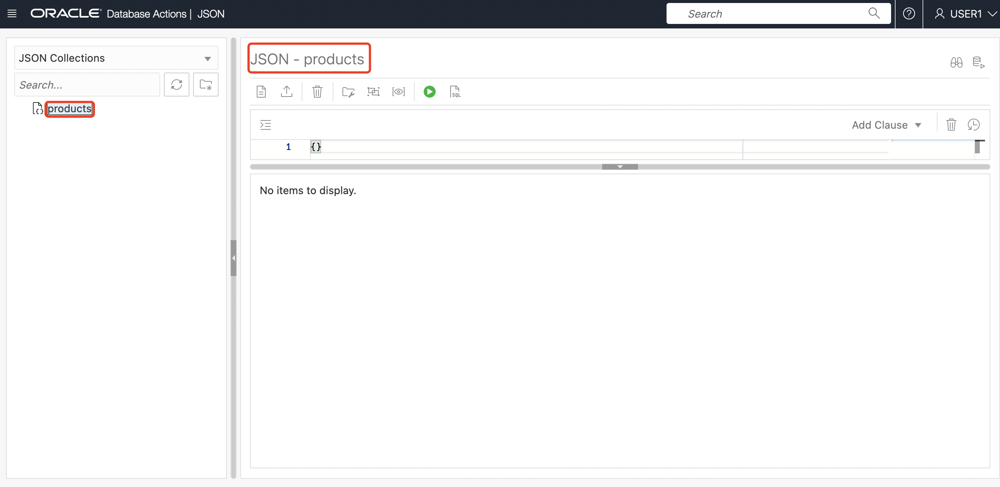

5. 点击**New JSON Document**图标

    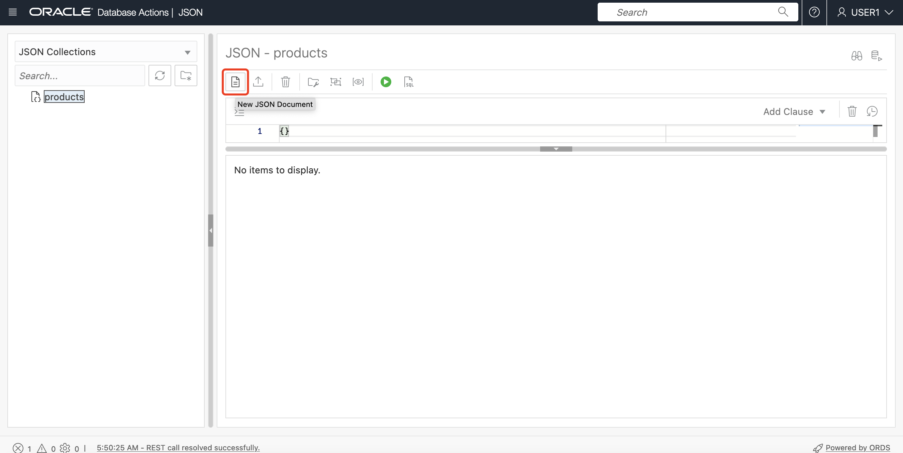

6. 拷贝下列JSON文档

    ```
    {
        "_id": 100,
        "type":"movie",
        "title": "Coming to America",
        "format": "DVD",
        "condition": "acceptable",
        "price": 5,
        "comment": "DVD in excellent condition, cover is blurred",
        "starring": ["Eddie Murphy", "Arsenio Hall", "James Earl Jones", "John Amos"],
        "year": 1988,
        "decade": "80s"
    }
    ```

    

7. 粘贴到新建JSON文档面板中，点击**Create**

    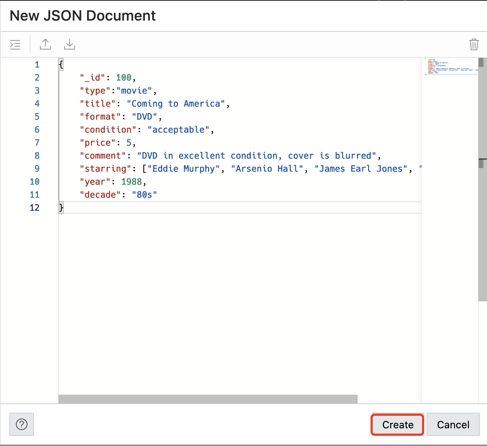

8. 新文档创建成功

    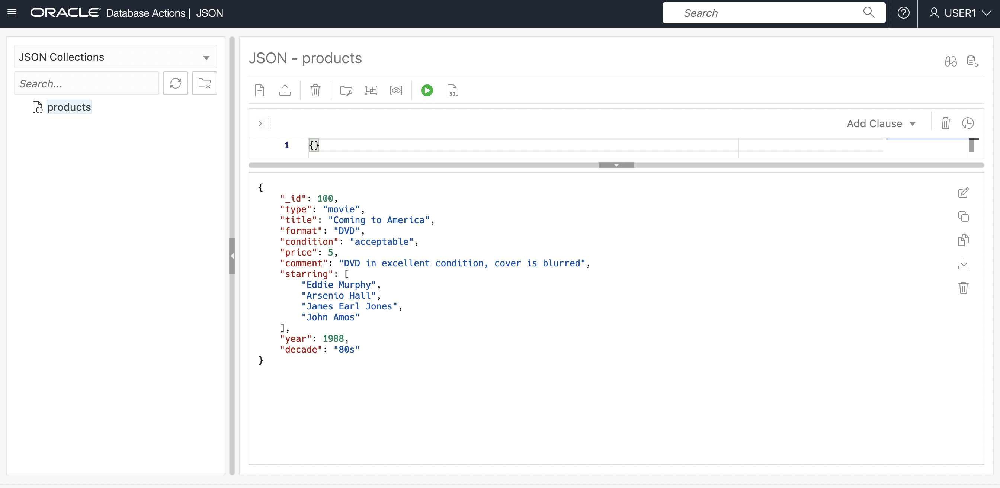

9. 同样的方法加入下面更多的文档

    ```
    {
        "_id": 101,
        "title": "The Thing",
        "type": "movie",
        "format": "DVD",
        "condition": "like new",
        "price": 9.50,
        "comment": "still sealed",
        "starring": [
            "Kurt Russel",
            "Wilford Brimley",
            "Keith David"
        ],
        "year": 1982,
        "decade": "80s"
    }
    ```

    ```
    {
        "_id": 102,
        "title": "Aliens",
        "type": "movie",
        " format ": "VHS",
        "condition": "unknown, cassette looks ok",
        "price": 2.50,
        "starring": [
            "Sigourney Weaver",
            "Michael Bien",
            "Carrie Henn"
        ],
        "year": 1986,
        "decade": "80s"
    }
    ```

    ```
    {
        "_id": 103,
        "title": "The Thing",
        "type": "book",
        "condition": "okay",
        "price": 2.50,
        "author":"Alan Dean Forster",
        "year": 1982,
        "decade": "80s"
    }
    ```

    

10. 我们可以根据筛选条件选择文档-我们将其简称“QBE”（Queries By Example）。QBE本身是一个JSON文档，它包含集合中JSON文档必须满足的字段和筛选条件，以便进行选择。QBE与SODA一起使用（仅限）。比如要查询id为101的文档，拷贝下列条件

    ```
    {"_id":101}
    ```

    

11. 粘贴查询条件并执行

    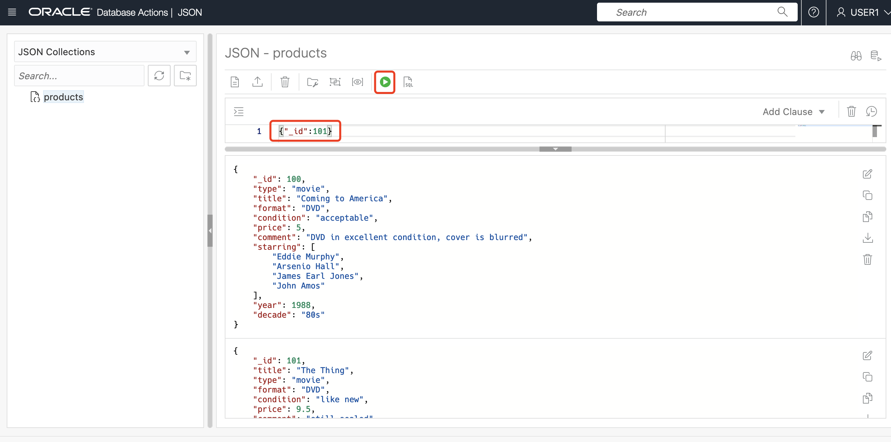

12. 返回查询结果

    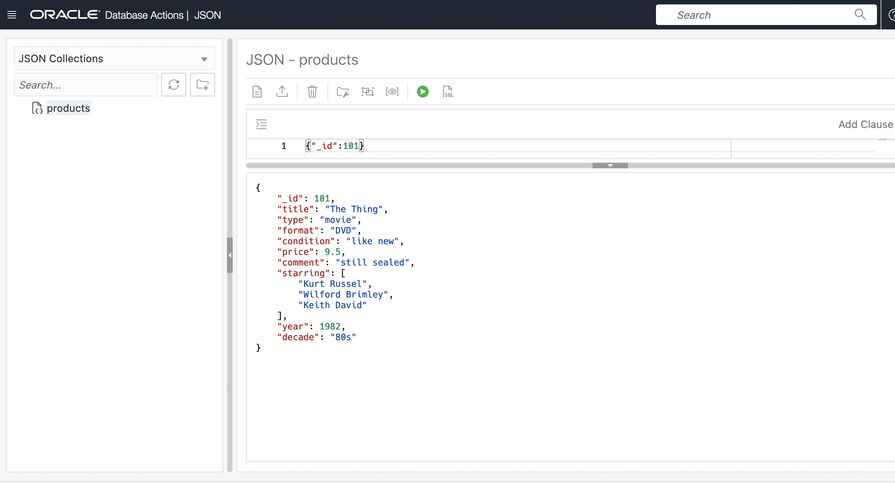

13. 查询所有DVD

    ```
    {"format":"DVD"}
    ```

    

14. 查询type类型不是movie的文档

    ```
    {"type":{"$ne":"movie"}}
    ```

    

15. 查询condition键的值包含`ok`字符的文档

    ```
    {"condition":{"$like":"%ok%"}}
    ```

    

16. 查询价格小于5的文档

    ```
    {"price":{"$lte":5}}
    ```

    

17. 组合条件查询，查询类型是movie价格高于5块的文档。

    ```
    {"$and":[{"price":{"$lte":5}}, {"type":"movie"}]}
    ```

    

    

## Task 3: 使用Oracle Database API for MongoDB

1. 在OCI控制台里点击Cloud Shell图标。

    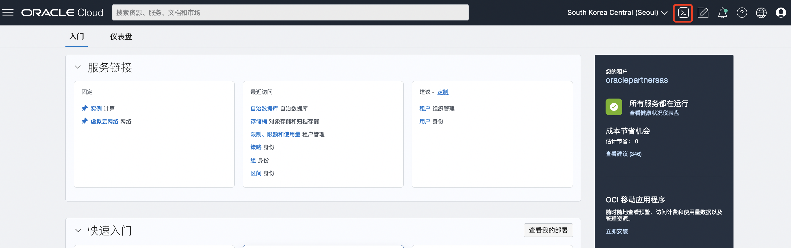

2. 在Cloud Shell里运行下列命令，创建新目录：

    ```
    mkdir mongotools
    cd mongotools
    ```

    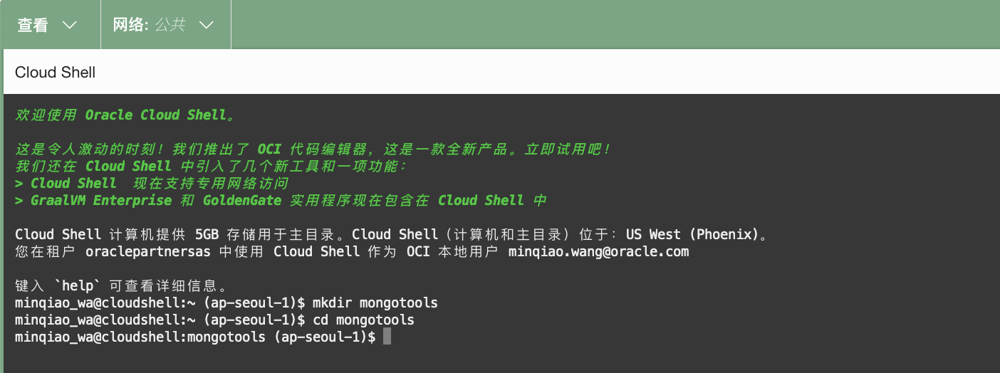

3. 运行下面命令安装MongoDB工具，MongoDB工具的最新版本URL链接可以在 [https://www.mongodb.com/try/download/database-tools ](https://www.mongodb.com/try/download/database-tools )中查询到。

    ```
    curl https://downloads.mongodb.com/compass/mongosh-1.5.1-linux-x64.tgz -o mongosh.tgz
    curl https://fastdl.mongodb.org/tools/db/mongodb-database-tools-rhel70-x86_64-100.5.4.tgz -o mongotools.tgz
    tar xvf mongosh.tgz
    tar xvf mongotools.tgz
    export PATH="`pwd`/mongodb-database-tools-rhel70-x86_64-100.5.4/bin/:`pwd`/mongosh-1.5.1-linux-x64/bin/:$PATH"
    ```

    

4. 修改你之前拷贝的Oracle Database API for MongoDB URI，将**[user:password@]**改为自己的用户名和密码，将**[user]**改为自己的用户名。

    ```
    mongodb://user1:WelcomePTS_2022%23@X***V-ATPTEST.adb.ap-seoul-1.oraclecloudapps.com:27017/user1?authMechanism=PLAIN&authSource=$external&ssl=true&retryWrites=false&loadBalanced=true
    
    ```

    

5. 注意：如果你的密码包含特殊字符，请按照下面的表格进行替换

    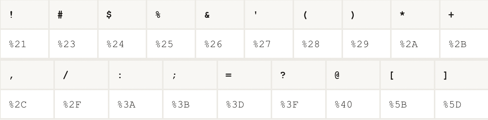

6. 将MongoDB URI保存到环境变量。

    ```
    export URI='mongodb://user1:WelcomePTS_2022%23@X***V-ATPTEST.adb.ap-seoul-1.oraclecloudapps.com:27017/user1?authMechanism=PLAIN&authSource=$external&ssl=true&retryWrites=false&loadBalanced=true'
    ```

    

7. 使用mongoimport的命令加载更多JSON文档。JSON文档存放在oci的对象存储中。

    ```
    curl -s https://objectstorage.us-ashburn-1.oraclecloud.com/n/idaqt8axawdx/b/products/o/products.ndjson | \
        mongoimport --collection products --uri $URI
    ```

    

8. 运行Mongo Shell，我们可以像访问MongoDB一样访问Oracle JSON DB。

    ```
    mongosh $URI
    ```

    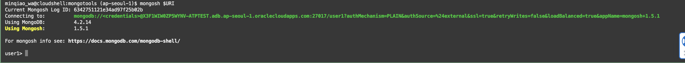

9. 查看数据库中的**collections**。

    ```
    show collections
    ```

    

10. 计算products中的文档数。

    ```
    db.products.countDocuments()
    ```

    

11. 查询id为100的产品。

    ```
    db.products.find( { "_id": 100} )
    ```

    

12. 查询价格大于11块钱的产品。

    ```
    db.products.find( {"price": {"$gt": 11} } )
    ```

    

13. 退出MongoDB Shell

    ```
    exit
    ```

    

    

## Task 4: 使用SODA for REST

1. 将之前拷贝的REST 和ORDS URL链接，后面附上`/user1/soda/latest`。如下所示

    ```
    https://x***v-atptest.adb.ap-seoul-1.oraclecloudapps.com/ords/user1/soda/latest
    ```

    

2. 打开浏览器，输入上面的URL。它将会列出你所建的JSON文档，包含product信息以及一些附加信息。

    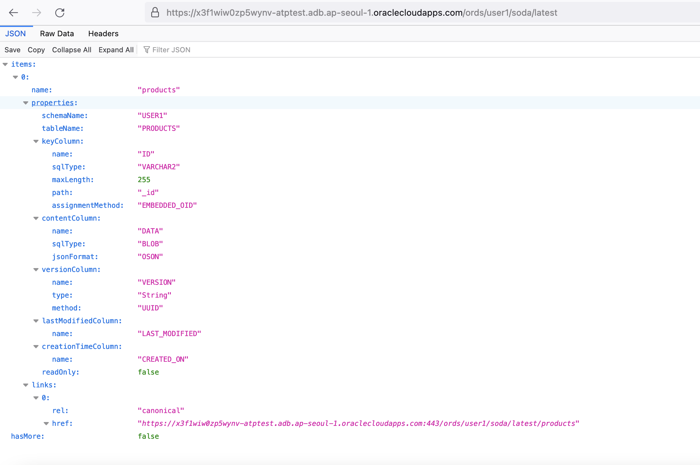

3. 在URL后面再加上`/products`，如下所示

    ```
    https://x***v-atptest.adb.ap-seoul-1.oraclecloudapps.com/ords/user1/soda/latest/products
    ```

    

4. 页面返回结果，显示所有产品信息。

    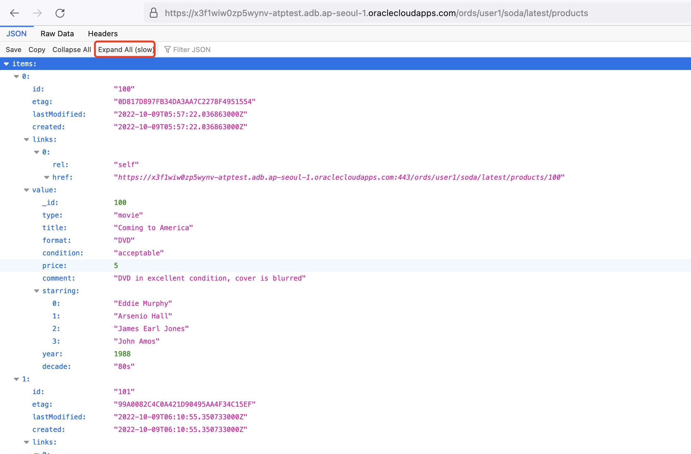

5. 在OCI Cloud Shell里运行下列命令，注意：REST URL是你自己的URL

    ```
    curl -X GET https://x***v-atptest.adb.ap-seoul-1.oraclecloudapps.com/ords/user1/soda/latest
    ```

    

6. 会得到一个unauthorized的错误，

    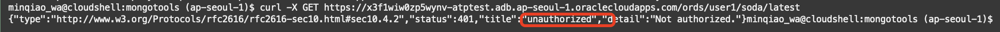

7. 需要增加`-u`认证选项，如下所示。（之所以前面浏览器没有出错，是因为我们已经认证登录了Database Actions。）

    ```
    curl -X GET https://x***v-atptest.adb.ap-seoul-1.oraclecloudapps.com/ords/user1/soda/latest -u user1:WelcomePTS_2022#
    ```

    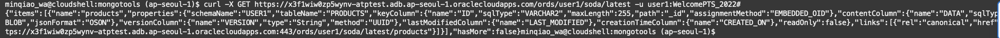

8. 我们可以通过curl来做QBE查询。通过post一个请求，增加`?action=query`参数来做查询，返回单价大于5块钱的商品。

    ```
    curl -X POST -H "Content-Type: application/json" --data '{"price":{"$gt":5}}' https://x***v-atptest.adb.ap-seoul-1.oraclecloudapps.com/ords/user1/soda/latest/products?action=query -u user1:WelcomePTS_2022#
    ```

    

9. 我们也可以通过post来插入一个新的文档，增加一个新的商品。

    ```
    curl -X POST -H "Content-Type: application/json" --data '{"id": 1414,"type": "Toy","title": "E.T. the Extra-Terrestrial","condition": "washed","price": 50.00,"description": "50cm tall plastic figure"}' https://x***v-atptest.adb.ap-seoul-1.oraclecloudapps.com/ords/user1/soda/latest/products -u user1:WelcomePTS_2022#
    ```

    

10. 要验证新的文档已经插入，我们可以进入Database Actions的JSON Worksheet，输入查询条件

    ```
    {"id":1414}
    ```

    

11. 可以看到查询结果

    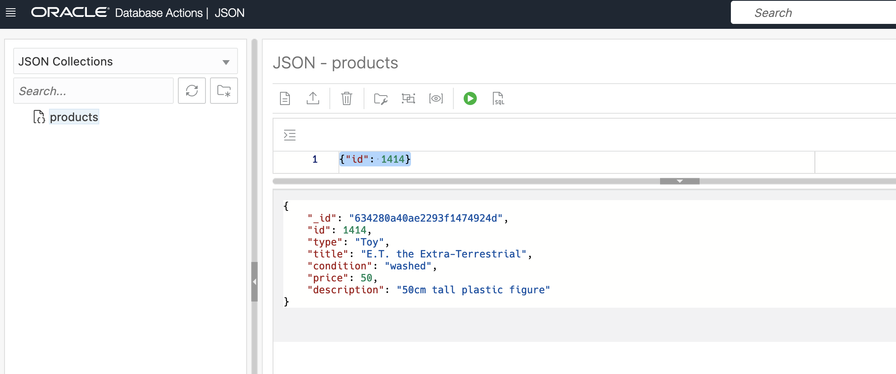

12. 
